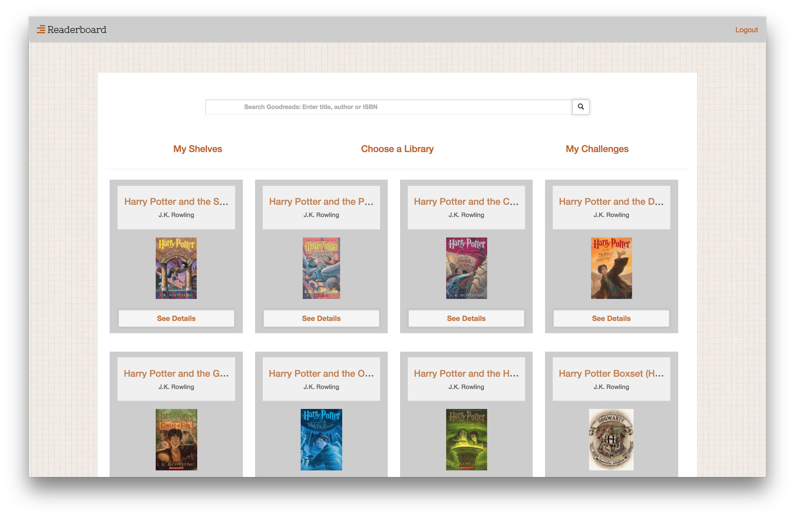
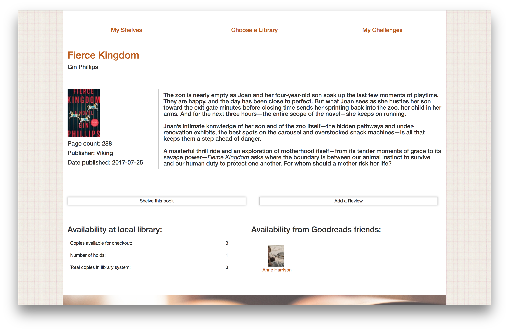

# Readerboard

A python/Flask web app for book lovers.  Learn more about the developer [here](https://www.linkedin.com/in/re-wilson/)
or [see Readerboard in action](#).

### Table of Contents

1. [Project Summary and Screenshots](#project-summary)
2. [Tech Stack](#tech-stack)
3. [MVP User Stories](#mvp-user-stories)
4. [2.0 and next steps](#2.0-goals)
5. [Testing Coverage/Instructions](#testing-coverage)
6. [Project Structure](#project-structure)
7. [Setup Instructions](#setup-instructions)

## Project Summary

Readerboard is a web app that gives readers a central location for tracking their reading habits and finding new books.  The search feature utilizes the Goodreads API, allowing the reader to view details about a book, add it to their shelves, and write a Goodreads book review.  Every book search also shows a list of friends on Goodreads who have read the book. The reader can see the book's availability at the library via the Overdrive API.   Each reader can view charts containing data about their reading habits and progress on custom reading challenges.  Readerboard retrieves user data from Goodreads via OAuth and relies on Chart.js to create meaningful, personalized content.

## Tech Stack

A full list of project dependencies can be found in [requirements.txt](./requirements.txt).

#### Backend
- Python
- Flask
- PostgreSQL

#### Frontend
- Javascript
- HTML/CSS
- Bootstrap
- jQuery

#### APIs
- Goodreads
- Overdrive

#### Other libraries and tools

- SQLAlchemy
- untangle (xml parsing)
- Chart.js
- rauth
- Jinja2 templating
- werkzeug SimpleCache

## MVP User Stories

| MVP Goals | Status |
| --- |--- |
| User can login and access GR account information via OAuth. | Completed :white_check_mark: |
|User can see the books on their shelves. | Completed :white_check_mark:|
|User can add a book to their shelves, and changes will be reflected in their goodreads account. | Completed :white_check_mark: |
| User can search for a book, and see if GR friends have marked it as read. | Completed :white_check_mark:
| User can search for a book and see it's availability as an ebook at the local library. | Completed :white_check_mark: |
| User can see their reading challenge progress. | Completed :white_check_mark: |
| User can add an additional reading challenge to their account. | Completed :white_check_mark: |
| User can submit a book review. | Completed :white_check_mark: |
| User can see data about their reading habits and history. | In progress :construction: |

## 2.0 Goals

##### Improvements

| Goal Description | Status |
| --- | --- |
| Finish Deployment | On Hold |
| Keep working on weird bugs within the current features | In progress :construction: |
| Get testing coverage up to 80% | In progress :construction: |
| Optimize the data retrieval and data update processes with celery/celerybeat | On Hold |

##### New Features

| Goal Description | Status |
| --- | --- |
| Incorporate the Overdrive Circulation API so users can check out a book or place a copy on hold from within the app | On Hold |
| Add a "watch list" feature that alerts the user when a book added to their list drops below a specific price threshold (Will use Twilio and Amazon Product APIs for this) | On Hold |
| convert the reading history page to React | On Hold |
| Add more data vis with Chart.js | On Hold |

## Testing Coverage

Unit and integration tests written with the python `unittest` library.  Testing is still in progress.

## Project Structure
#### server.py - Core of the flask app, lists all routes
#### model.py - database structure and db creation.
#### parser.py - handles most Goodreads requests and in cases where xml is returned, parses response.
#### helpers.py - small helper functions and most Overdrive API request functions found here.

## Setup Instructions

1. install python
2. ...
3. profit
- (real instructions coming soon!)

